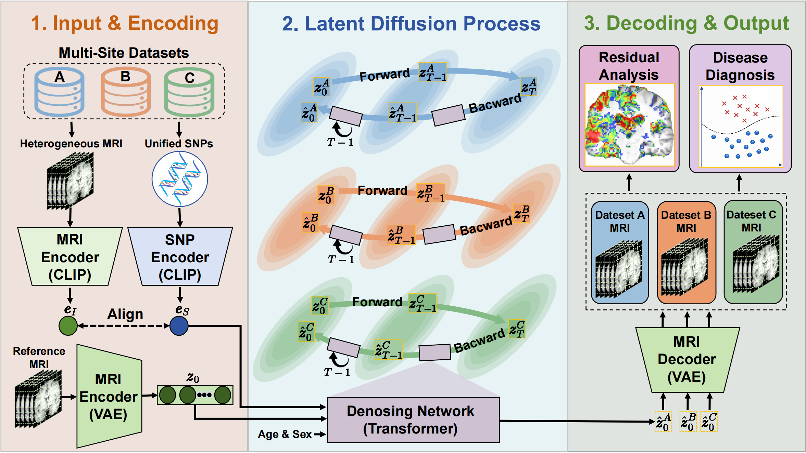

# DCDDIM
Source codes for the paper "Domain-Constrained Denoising Diffusion Implicit Model for Genetic-Conditioned Multi-Site Neuroimaging Generation".

## Task Overview



## Training

```bash
# The training process of DCDDIM
python ddim-clip_train_attn_interp_gene-trans-t1.py
```
## Testing

```bash
# The testing process of DCDDIM
python ddim-clip_knock-test_attn_interp_gene-trans-t1.py
```

## License

This project is licensed under the MIT License - see the [LICENSE](LICENSE) file for details.
